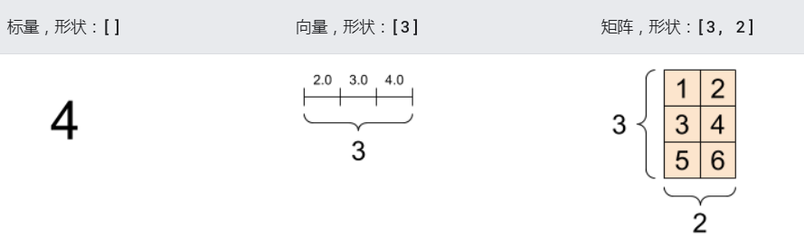
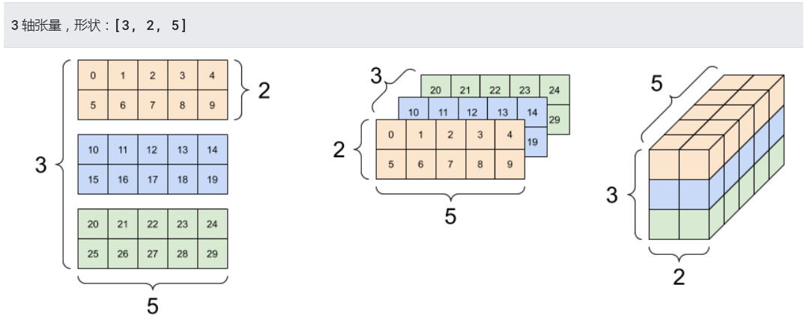

# 深度学习之pytorch   

## 一、pytorch简介

### 简介

- PyTorch是一个建立在Torch库之上的Python包，是由Facebook开源的神经网络框架，旨在加速深度学习应用。它提供一种类似NumPy的抽象方法来表征张量（或多维数组），它可以利用GPU来加速训练。Torch 是一个经典的对多维矩阵数据进行操作的张量（tensor ）库，包含自动求导系统的深度神经网络，提供了高度灵活性和效率的深度学习实验性平台，在机器学习和其他数学密集型应用有广泛应用。
- 与Tensorflow的静态计算图不同，pytorch的计算图是动态的，可以根据计算需要实时改变计算图。

### pytorch的发展历史

1. Pytorch从 2017 年年初发布以来，PyTorch 可谓是异军突起，短时间内取得了一系列成果，成为其中的明星框架。最近Pytorch进行了一些较大的版本更新，0.4版本把Varable与Tensor进行了合并，增加了Windows的支持，实现了张量（Tensor）和变量（Variable）的合并。
2. PyTorch 1.0，分布式训练方式大幅更改，PyTorch在分布式计算方面开始对不同的后端有了完善的支持，包括MPI和NCCL等。1.0版本增加了JIT（全称Justintimecompilation，即时编译，它弥补了研究与生产的部署的差距）、更快的分布式、C++扩展等。
3. PyTorch 1.1，PyTorch开始支持TensorBoard对于张量的可视化，并且加强了JIT的功能。
4. PyTorch 1.2增强了TorchScript的功能，同时增加了Transformer模块，也增加了对视频、文本和音频的训练数据载入的支持。
5. PyTorch 1.3，增加了移动端的处理，而且增加了对模型的量化功能（Quantization）的支持。
6. PyTorch 1.4，支持Python2的最后一版，支持分布式模型并行、Java程序、移动端等多项新功能
7. 目前最新版本是1.10，新版本不太稳定，1.8版本是距离最新版较稳定的，教学环境使用1.8版本。

### pytorch的优势

1. 简洁：
   PyTorch的设计追求最少的封装，尽量避免重复造轮子。不像 TensorFlow 中充斥着session、graph、operation、name_scope、variable、tensor、layer等全新的概念，PyTorch 的设计遵循tensor→variable(autograd)→nn.Module 三个由低到高的抽象层次，分别代表高维数组（张量）、自动求导（变量）和神经网络（层/模块），而且这三个抽象之间联系紧密，可以同时进行修改和操作。
2. 速度：
   PyTorch 的灵活性不以速度为代价，在许多评测中，PyTorch 的速度表现胜过 TensorFlow等框架。
3. 灵活易用：
   PyTorch 是所有的框架中面向对象设计的最优雅的一个。PyTorch的面向对象的接口设计来源于Torch，而Torch的接口设计以灵活易用而著称。。
4. 活跃的社区：
   PyTorch 提供了完整的文档，循序渐进的指南，作者亲自维护的论坛，供用户交流和求教问题。Facebook 人工智能研究院对 PyTorch 提供了强力支持。

### pytorch常用工具包

- torch：类似于Numpy的通用数组库，可将张量类型转为torch.cuda.TensorFloat，并在GPU上进行计算。
- torch.autograd：用于构建计算图形并自动获取梯度的包。
- torch.nn：具有共享层和损失函数的神经网络库。
- torch.optim：具有通用优化算法（如SGD，Adam等）的优化包。
- torch.utils：数据载入器。具有训练器和其他便利功能；   

## 二、pytorch的安装

- linux和windows在线安装

  ```shell
  # cpu版本的
  pip3 install torch==1.8.0+cpu torchvision==0.9.0+cpu  -f https://download.pytorch.org/whl/torch_stable.html
  # CUDA 11.1
  pip3 install torch==1.8.0+cu111 torchvision==0.9.0+cu111 torchaudio==0.8.0 -f https://download.pytorch.org/whl/torch_stable.html
  ```

- 离线安装

  1. 查看python版本

  2. [下载对应版本](https://download.pytorch.org/whl/torch_stable.html)

     

     

     

  3. 去对应下载目录下执行安装命令即可

     ```shell
     linux离线安装
     
     windows离线安装
   pip3 install 下载路径\***torch-***-cp**-cp**-win_amd64.whl
     pip3 install 下载路径\***torchvision-***-cp**-cp**-win_amd64.whl
     ```
  4. 检查安装情况

  ```
  
   import torch
     print(torch.__version__)  # 查看pytorch版本
  ```


## 三、pytorch基本操作

### 1.张量

#### 1）张量的创建

##### 1、使用torch.tensor()函数创建张量

张量是具有统一类型（称为 `dtype`）的多维数组。

```python
import torch
# 下面是一个“标量”（或称“0 秩”张量）, 标量包含单个值，但没有“轴”
rank_0_tensor = torch.tensor(4)
print("************标量************")
print(rank_0_tensor)

# “向量”（或称“1 秩”张量）就像一个值的列表。向量有 1 个轴
rank_1_tensor = torch.tensor([2.0, 3.0, 4.0])
print("************向量************")
print(rank_1_tensor)

# # “矩阵”（或称“2 秩”张量）有 2 个轴
rank_2_tensor = torch.tensor([[1, 2],
                             [3, 4],
                             [5, 6]])
print("************矩阵************")
print(rank_2_tensor)


# 张量的轴可能更多，下面是一个包含 3 个轴的张量
rank_3_tensor = torch.tensor([
  [[0, 1, 2, 3, 4],
   [5, 6, 7, 8, 9]],
  [[10, 11, 12, 13, 14],
   [15, 16, 17, 18, 19]],
  [[20, 21, 22, 23, 24],
   [25, 26, 27, 28, 29]],])

print("************张量************")
print(rank_3_tensor)
```





执行结果：

```python
************标量************
tensor(4)
************向量************
tensor([2., 3., 4.])
************矩阵************
tensor([[1, 2],
        [3, 4],
        [5, 6]])
************张量************
tensor([[[ 0,  1,  2,  3,  4],
         [ 5,  6,  7,  8,  9]],

        [[10, 11, 12, 13, 14],
         [15, 16, 17, 18, 19]],

        [[20, 21, 22, 23, 24],
         [25, 26, 27, 28, 29]]])
```

##### 2、使用torch.xx_like()创建张量

`torch.ones_like(X), torch.zeros_like(X)`可以分别用于创建一个与张量X具有相同维度的全1、全0的张量。

```python
import torch
x = torch.tensor([[1.2,2.1,3.4],[4.2,5.6,6]])
print(torch.ones_like(x)) # 创建一个与张量x具有相同维度的全1张量
print(torch.zeros_like(x)) # 创建一个与张量x具有相同维度的全0张量


*************************************
tensor([[1., 1., 1.],
        [1., 1., 1.]])
tensor([[0., 0., 0.],
        [0., 0., 0.]])
```

##### 3、随机数生成张量

`torch.normal(mean, std)`可以通过传入指定的均值张量和标准差张量，从而生成一个对应满足该分布的随机数张量，当mean和std传入多个值时，则会相应得到多个随机数张量。均值和方差向量的维度需要满足广播机制。 `torch.rand(shape), torch.randn(shape)`则是用于生成服从[0,1]区间上均匀分布的张量以及服从标准正态分布的张量。

```python
import torch
# 生成均值为0.5，标准差为0.08的三行三列的张量
print(torch.normal(mean=0.5,std=0.08,size=(3,3)))
# torch.rand(shape)：生成服从[0,1]区间上均匀分布的张量
print(torch.rand(3,4))
#  torch.randn(shape)  服从标准正态分布的张量
print(torch.randn(3,4))

***********************************
tensor([[0.3715, 0.5626, 0.6282],
        [0.5394, 0.4867, 0.3812],
        [0.3361, 0.4272, 0.5188]])
tensor([[0.4524, 0.7757, 0.9625, 0.2930],
        [0.2034, 0.0456, 0.2400, 0.6823],
        [0.7413, 0.8727, 0.0973, 0.8507]])
tensor([[ 1.4150,  0.2149, -0.7027,  1.8567],
        [-1.9695, -0.7636, -0.7776, -0.6768],
        [ 1.5098, -1.2459,  0.3386, -0.0569]])


```

##### 4、按照数值内容创建张量

`torch.zeros(shape),torch.ones(shape)`可以通过指定shape来创建一个全0、全1的一个张量。

```python
import torch
print("全0张量：",torch.zeros(5,2))
print("全1张量：",torch.ones(5,2))

**********************************************
全0张量： tensor([[0., 0.],
        [0., 0.],
        [0., 0.],
        [0., 0.],
        [0., 0.]])
全1张量： tensor([[1., 1.],
        [1., 1.],
        [1., 1.],
        [1., 1.],
        [1., 1.]])
```


#### 2）张量支持的数据类型

在PyTorch中，张量也就是tensor，分别有两大类型：浮点型和整型。其中浮点型按照精度不同，又分为16位、32位以及64位；整型则根据有无符号位以及精度，又分为8位无符号整型、8位有符号整型、16位有符号整型、32位有符号整型以及64位有符号整型。每个类型又可以区分为CPU类型以及GPU类型。具体如下图所示：


一般常用的就是32位浮点型，而且**只有浮点型才可以计算梯度**。训练用的标签则一般是整型中的32或64位。 我们可以使用`tensor.dtype`来查看当前tensor的数据类型。

- 查看张量的类型

  ```python
  p1 = torch.tensor([1,2,3]) # 长整型（64位）
  p2 = torch.tensor([1.,2.,4.]) # 浮点型（32位）
  p3 = torch.tensor([True,False,True]) # torch.BoolTensor
  print(p1,p1.type())
  print(p2,p2.type())
  print(p3,p3.type())
  ```

- 指定张量类型

  ```python
  # 1、通过dtype指定
  p1 = torch.tensor([1,2,3],dtype=torch.float16) # 浮点型16
  p2 = torch.tensor([1.,2.,4.],dtype=torch.int32) # 整型（32位）
  p3 = torch.tensor([True,False,True],dtype=torch.int8) # 整型（8位）
  print(p1,p1.type())
  print(p2,p2.type())
  print(p3,p3.type())
  # 2、直接指定类型
  p1 = torch.FloatTensor([1,2,3]) # 浮点型（32位）
  p2 = torch.DoubleTensor([1,2,4]) # 浮点型（64位）
  p3 = torch.IntTensor([True,False,True]) # 整型（32位）
  print(p1,p1.type())
  print(p2,p2.type())
  print(p3,p3.type())
  ```

- 数据类型的转换

  ```python
  使用type函数转换
  p1 = torch.FloatTensor([1,2,3]) # 浮点型（32位）
  print(p1,p1.type())
  p2 = p1.type(torch.int32) # 浮点型-->整型
  print(p2,p2.type())
  ```

#### 3）张量的形状

张量有形状。下面是几个相关术语：

- **形状**：张量的每个维度的长度（元素数量）。
- **秩**：张量的维度数量。标量的秩为 0，向量的秩为 1，矩阵的秩为 2。
- **轴**或**维度**：张量的一个特殊维度。
- **大小**：张量的总项数，即乘积形状向量。

1、改变张量形状

`tensor.reshape(shape), torch.reshape(input, shape), tensor.resize_(shape),  tensor.view(shape)` 可以根据指定的shape对原tensor进行reshape操作。

> 1. 在PyTorch中，以“_”结尾的函数操作一般表示原地操作，直接对原tensor进行操作。
> 2. torch.reshape和tensor.view都可以用来调整tensor的形状，但view函数要求作用的tensor在内存中连续存储，如果对tensor调用过transpose,permute等操作后就无法直接使用view，而需要使用tensor.contiguous来获得一个连续的copy，而reshape则没有这个要求

```python
"""
张量形状的操作
"""
import torch

a = torch.arange(8)
b = a.reshape(2,4) # 不改变原来的形状
print("*"*25+"reshape改变张量的形状"+"*"*25,a,b,sep='\n')
c = a.view(2,4) # 不改变原来的形状
print("*"*25+"view改变张量的形状"+"*"*25,a,c,sep='\n')
d = a.resize_(2,4) # 改变原来的形状
print("*"*25+"resize_改变张量的形状"+"*"*25,a,d,sep='\n')
```

执行结果：

```python
*************reshape改变张量的形状*********
tensor([0, 1, 2, 3, 4, 5, 6, 7])
tensor([[0, 1, 2, 3],
        [4, 5, 6, 7]])
**************view改变张量的形状**************
tensor([0, 1, 2, 3, 4, 5, 6, 7])
tensor([[0, 1, 2, 3],
        [4, 5, 6, 7]])
************resize_改变张量的形状**************
tensor([[0, 1, 2, 3],
        [4, 5, 6, 7]])
tensor([[0, 1, 2, 3],
        [4, 5, 6, 7]])
```

2、改变张量维度

- `torch.unsqueeze(tensor, dim)`可以在张量的指定维度插入一个新的维度，得到一个新的张量，也可以使用`tensor.unsqueeze_(dim)`进行原地操作。一般是用于给灰度图扩展维度使用，灰度图倘若使用灰度方式读取的话，最终得到的shape为`B, H, W`，是不符合PyTorch四个维度的要求的，此时可以使用`tensor.unsqueeze_(dim=1)`来扩充一个维度，得到的新tensor的shape为`B, 1, H, W`即可进行后续操作了。
- `torch.squeeze(tensor, dim)`功能则正好相反，它可以移除指定或者所有维度大小为1（不指定维度时）的维度，从而得到一个维度减小的新张量，类似的也可以使用`tensor.squeeze_(dim)`进行原地操作。一般用于全卷积网络做分类时的多余维度压缩用，在使用全卷积网络得到最后分类的时（shape为`B, C, H, W`， C即为待分类数），此时使用Global Average Pooling对特征图的空间信息进行压缩和进一步提取，得到feature map的shape为`B, C, 1, 1`，此时即可使用`tensor.squeeze_()`对维度进行压缩，得到shape为`B, C`的分类向量，即可用于后续loss计算。

```python
import torch

# 0代表行扩展,1代表列扩展.
print("*"*50)
t = torch.arange(5)
print(t,t.dim(),t.shape) 
# 行方向增加维数为1的维度
t1 = t.unsqueeze(dim=0)
print(t1,t1.dim(),t1.shape) 
# 列方向增加维数为1的维度
t2 = t.unsqueeze(dim=1)
print(t2,t2.dim(),t2.shape)

# 行方向减少维数为1的维度
t3 = t1.squeeze(dim=0)
print(t3,t3.dim(),t3.shape)

# 列方向减少维数为1的维度
t4 = t2.squeeze(dim=1)
print(t4,t4.dim(),t4.shape)
# tensor.squeeze_(dim)进行原地操作
t5 = t1.squeeze_(dim=0)
print(t5,t1)
```

执行结果：

```python
tensor([0, 1, 2, 3, 4]) 1 torch.Size([5])
tensor([[0, 1, 2, 3, 4]]) 2 torch.Size([1, 5])
tensor([[0],
        [1],
        [2],
        [3],
        [4]]) 2 torch.Size([5, 1])
tensor([0, 1, 2, 3, 4]) 1 torch.Size([5])
tensor([0, 1, 2, 3, 4]) 1 torch.Size([5])
tensor([0, 1, 2, 3, 4]) tensor([0, 1, 2, 3, 4])
```

#### 4）与Numpy数据相互转化

- 将Numpy数组转化为PyTorch张量：`torch.as_tensor(ndarray), torch.from_numpy(ndarray)`

- 将PyTorch张量转化为Numpy数组：`tensor.numpy()`

```python
"""
Pytorch和Numpy的相互转换
"""
import torch
import numpy as np

# 创建一个numpy
numpy_tensor = np.random.rand(3,3)
print(numpy_tensor)


#我们可以使用下面两种方式将numpy的ndarray转换到tensor上
pytorch_tensor = torch.as_tensor(numpy_tensor)
print(pytorch_tensor)
pytorch_tensor = torch.from_numpy(numpy_tensor)
print(pytorch_tensor)


# 使用下面的方法将 pytorch tensor 转换为 numpy ndarray
numpy_array = pytorch_tensor.numpy()
print(numpy_array,type(numpy_array))


```

  执行结果：

```python
**********numpy的ndarray********
[[0.03120807 0.07410954 0.26837053]
 [0.75004493 0.18683975 0.17383892]
 [0.00700366 0.80521463 0.23792894]]
***********torch.as_tensor转换后********
tensor([[0.0312, 0.0741, 0.2684],
        [0.7500, 0.1868, 0.1738],
        [0.0070, 0.8052, 0.2379]], dtype=torch.float64)
*****************from_numpy转换后***************
tensor([[0.0312, 0.0741, 0.2684],
        [0.7500, 0.1868, 0.1738],
        [0.0070, 0.8052, 0.2379]], dtype=torch.float64)
**************pytorch转换为numpy*************
[[0.03120807 0.07410954 0.26837053]
 [0.75004493 0.18683975 0.17383892]
 [0.00700366 0.80521463 0.23792894]]
<class 'numpy.ndarray'>
```


#### 5）数学计算

###### 1、基本的数学计算

与Numpy一样，tensor也有逐元素操作（element-wise），操作内容相似，但使用函数可能不尽相同。下面是相关的数学计算的操作：

| 函数          | 说明                   |
| :------------ | :--------------------- |
| pow           | 幂                     |
| mul(或*)      | 逐元素相乘             |
| mean          | 均值                   |
| sum（tensor） | 返回tensor所有元素的和 |

代码实现：

```python
"""
基本的数学计算
"""
import torch

t = torch.tensor([[1, 2.5, -3],
                  [4, -5.6, 6],
                  [-1.7, 9, 2.3]],dtype=torch.float32)


print("*" * 10 + "pow(幂)" + "*" * 10, t.pow(2), sep='\n')
print("*" * 10 + "mul(逐个元素相乘)" + "*" * 10, torch.mul(t,t), sep='\n')
print("*" * 10 + "mean(均值)" + "*" * 10, torch.mean(t), sep='\n')
print("*" * 10 + "sum(所有元素的和)" + "*" * 10, t.sum(), sep='\n')

```

###### 2、矩阵的运算

| 函数                              | 说明               |
| --------------------------------- | ------------------ |
| dot（t1,t2）                      | 计算一维张量的点积 |
| mm(mat1,mat2)/matmul(mat1,mat2)/@ | 计算矩阵的乘法     |
| t()                               | 转置               |

**说明：**

> 1、torch的dot与Numpy的dot有点不同，torch中dot对两个为1D张量进行点积运算，Numpy中的dot无此限制。
> 2、mm只能进行矩阵乘法,也就是输入的两个tensor维度只能是(n×m)和( m × p ) 
> 3、matmul可以进行张量乘法, 输入可以是高维.

```python
t1 = torch.arange(1,5)
t2 = torch.arange(3,7)
print("t1:",t1)
print("t2:",t2)
print("*" * 10 + "dot(一维张量的积)" + "*" * 10,torch.dot(t1,t2),sep='\n')

t3 = torch.arange(1,7).reshape(2,3)
print("t3:",t3)
t4 = torch.arange(2,11).reshape(3,3)
print("t4:",t4)
print("*" * 10 + "mm(二维张量的积)" + "*" * 10,torch.mm(t3,t4),sep='\n')
print("*" * 10 + "matmul(二维张量的积)" + "*" * 10,torch.matmul(t3,t4),sep='\n')
print("*" * 10 + "@(二维张量的积)" + "*" * 10,t3 @ t4,sep='\n')
print("*" * 10 + "t(转置)" + "*" * 10,t3.t(),sep='\n')

```

```
t1: tensor([1, 2, 3, 4])
t2: tensor([3, 4, 5, 6])
**********dot(一维张量的积)**********
tensor(50)
t3: tensor([[1, 2, 3],
        [4, 5, 6]])
t4: tensor([[ 2,  3,  4],
        [ 5,  6,  7],
        [ 8,  9, 10]])
**********mm(二维张量的积)**********
tensor([[ 36,  42,  48],
        [ 81,  96, 111]])
**********matmul(二维张量的积)**********
tensor([[ 36,  42,  48],
        [ 81,  96, 111]])
**********@(二维张量的积)**********
tensor([[ 36,  42,  48],
        [ 81,  96, 111]])
**********t(转置)**********
tensor([[1, 4],
        [2, 5],
        [3, 6]])

```

### 3、自动求导

#### 1）变量

**PyTorch 变量**，是神经网络计算图里特有的一个概念，就是Variable提供了自动求导的功能，学过[Tensorflow](https://geek-docs.com/tensorflow)的同学应该清楚神经网络在做运算的时候需要先构造一个计算图谱，然后在里面运行前向传播和反向传播。
Variable和[Tensor](https://geek-docs.com/pytorch/pytorch-tutorial/pytorch-tensor.html)本质上没有区别，不过Variable会被放入一个计算图中，然后进行前向传播，反向传播，自动求导。

在0.4之前的版本中，PyTorch通过使用Variable类来自动计算所有的梯度。Variable是在`torch.autograd.Variable`中，`Variable`主要包含3个属性，如下所示：


而从0.4版本开始，为了简化使用，PyTorch就将Variable类合并到Tensor中去了，因此我们现在可以直接通过Tensor来使用Autograd模块提供的功能。要使用Autograd，我们只需在创建Tensor时设置属性requries_grad为True即可。一旦我们将requries_grad属性设置为True，就表明我们需要对该Tensor进行自动求导，PyTorch会记录该Tensor的每一步操作历史并自动计算。

**requires_grad**: 如果需要为张量计算梯度，则为True，否则为False。我们使用pytorch创建tensor时，可以指定requires_grad为True（默认为False），

#### 2）Autograd模块

autograd包为对tensor进行自动求导，为实现对tensor自动求导，需考虑如下事项：
（1）创建叶子节点(leaf node)的tensor，使用requires_grad参数指定是否记录对其的操作，以便之后利用backward()方法进行梯度求解。requires_grad参数缺省值为False，如果要对其求导需设置为True。
（2）可利用requires_grad_()方法修改tensor的requires_grad属性。可以调用.detach()或with torch.no_grad():将不再计算张量的梯度，跟踪张量的历史记录。这点在评估模型、测试模型阶段常常使用。
（3）通过运算创建的tensor（即非叶子节点），会自动被赋于grad_fn属性。该属性表示梯度函数。叶子节点的grad_fn为None。
（4）最后得到的tensor执行backward()函数，此时自动计算各变量的梯度，并将累加结果保存grad属性中。计算完成后，非叶子节点的梯度自动释放。
（5）backward()函数接受参数，该参数应和调用backward()函数的Tensor的维度相同。如果求导的tensor为标量（即一个数字），backward中参数可省略。
（6）反向传播的中间缓存会被清空，如果需要进行多次反向传播，需要指定backward中的参数retain_graph=True。多次反向传播时，梯度是累加的。
（7）非叶子节点的梯度backward调用后即被清空。
（8）可以通过用torch.no_grad()包裹代码块来阻止autograd去跟踪那些标记为.requesgrad=True的张量的历史记录。这步在测试阶段经常使用。
整个过程中，Pytorch采用计算图的形式进行组织，该计算图为动态图，它的计算图在每次前向传播时，将重新构建。其他深度学习架构，如TensorFlow、Keras一般为静态图。

#### 3）自动求导

自动求导使用backward( )函数进行反向传播来计算指定Tensor的梯度，在调用backward( )函数前，Tensor的grad属性为None。如果Tensor表示的是一个标量（只有一个元素的Tensor），则不需要为backward( )指定任何参数，但是如果它有更多的元素，则需要指定一个gradient参数，它是形状匹配的张量。实际上是先求出Jacobian矩阵中每一个元素的梯度值(每一个元素的梯度值的求解过程对应上面的计算图的求解方法)，然后将这个Jacobian矩阵与`gradient参数`对应的矩阵进行对应的点乘，得到最终的结果。

#### 4）计算图

计算图是一种有向无环图像，用图形方式表示算子与变量之间的关系，直观高效。

如图所示，圆形表示变量，矩阵表示算子。如表达式：z=wx+b，可写成两个表示式：y=wx，则z=y+b，其中x、w、b为变量，是用户创建的变量，不依赖于其他变量，故又称为叶子节点。为计算各叶子节点的梯度，需要把对应的张量参数requires_grad属性设置为True，这样就可自动跟踪其历史记录。y、z是计算得到的变量，非叶子节点，z为根节点。mul和add是算子（或操作或函数）。由这些变量及算子，就构成一个完整的计算过程（或前向传播过程）。


Pytorch调用backward()，将自动计算各节点的梯度，如下图所示，这是一个反向传播过程。在反向传播过程中，autograd沿着图，从当前根节点z反向溯源，利用导数链式法则，计算所有叶子节点的梯度，其梯度值将累加到grad属性中。对非叶子节点的计算操作记录在grad_fn属性中，叶子节点的grad_fn值为None。


##### 标量反向传播

假设x、w、b都是标量，z=wx+b，对标量z调用backward()，我们无需对backward()传入参数。

1. 定义叶子节点及算子节点

   ```python
   """
   标量的反向传播
       z=wx+b，对标量z调用backward()，我们无需对backward()传入参数
   """
   import torch
   
   # 定义一个标量x
   x = torch.tensor(2)
   # 初始化权重参数w,偏置b，并设置requires_grad属性为True
   w = torch.tensor(1,dtype=torch.float32,requires_grad=True)
   b = torch.tensor(1,dtype=torch.float32,requires_grad=True)
   # 实现前向传播
   y = torch.mul(w,x)
   z = torch.add(y,b)
   # 查看y,z节点的属性requires_grad
   print(f"y,z节点的requires_grad属性：{y.requires_grad}，{z.requires_grad}")
   
   # 基于z做反向传播,执行backward之后计算图会自动清空
   z.backward()
   
   # 叶子节点的梯度,x是叶子节点但它无需求导，故其梯度为None
   print(f"w,b,x的梯度分别为：{w.grad}，{b.grad}，{x.grad}")
   
   # 非叶子节点的梯度,执行backward之后，会自动清空
   print(f"y,z的梯度分别为：{y.grad}，{z.grad}")
   
   ```
   
   执行结果：
   
   ```
   y,z节点的requires_grad属性：True，True
   w,b,x的梯度分别为：2.0，1.0，None
   y,z的梯度分别为：None，None
   ```


##### 非标量反向传播

Pytorch有个简单的规定，不让张量(tensor)对张量求导，只允许标量对张量求导，因此，如果目标张量对一个非标量调用backward()，需要传入一个gradient参数,该参数也是张量，而且需要与调用backward()的张量形状相同。

```python
"""
 非标量反向传播
"""

import torch

# 定义叶子节点张量a,b
a = torch.tensor([2, 3], dtype=torch.float32, requires_grad=True)
b = torch.tensor([5, 6], dtype=torch.float32, requires_grad=True)

# 定义f与a,b之间的映射关系：
f = a * b

# 反向传播
# 这里f是非标量张量所以我们需要把梯度参数传递给和张量f维数相同的反向传播函数
gradients = torch.ones_like(f)
f.backward(gradient=gradients)

print(a.grad)   # tensor([5., 6.])
print(b.grad)   # tensor([2., 3.])
```

##### 对比

**tensorflow的forward只会根据第一次模型前向传播来构建一个静态的计算图, 后面的梯度自动求导都是根据这个计算图来计算的, 但是pytorch则不是, 它会为每次forward计算都构建一个动态图的计算图, 后续的每一次迭代都是使用一个新的计算图进行计算的.非常灵活，易调节**

### 4、综合案例：简单线性回归

```python
"""
pytorch使用Tensor及antograd实现简单线性回归
主要步骤：
    1、给出一个数组x，然后基于表达式：y=3x+2，加上一些噪音数据到达另一组数据y。
    2、构建一个机器学习模型，学习表达式y=wx+b的两个参数w，b。利用数组x，y的数据为训练数据
    3、采用梯度梯度下降法，通过多次迭代，学习到w、b的值。
"""

import torch as t
from matplotlib import pyplot as plt

# 1、生成训练数据
t.manual_seed(100)  # 设置随机数种子，生成同一个份数据，以便用多种方法进行比较
x = t.unsqueeze(t.linspace(-1, 1, 100), dim=1)  # 生成x坐标数据，x为tenor，需要把x的形状转换为100x1
# 生成y坐标数据，y为tenor，形状为100x1，另加上一些噪音
y = 3 * x + 2 + 0.2 * t.rand(x.size())
# 画图，把tensor数据转换为numpy数据
plt.figure()
plt.scatter(x.numpy(), y.numpy())
# plt.show()

# 2.初始化权重参数
# 随机初始化参数，参数w，b为需要学习的，故需requires_grad=True
w = t.randn(1, 1, dtype=t.float32, requires_grad=True)
b = t.zeros(1, 1, dtype=t.float32, requires_grad=True)

# 3.训练模型

lr = 0.001  # 学习率

for i in range(500):
    # 前向传播，并定义损失函数
    y_pred = x.mm(w) + b
    loss = 0.5 * (y_pred - y) ** 2
    loss = loss.sum()

    # 自动计算梯度，梯度存放在grad属性中
    loss.backward()  # loss是标量，无需参数

    # 手动更新参数，需要用torch.no_grad,使上下文环境中切断自动求导的计算
    with t.no_grad():  # 数据不需要计算梯度
        w -= lr * w.grad
        b -= lr * b.grad

        # 梯度清零
        w.grad.zero_()
        b.grad.zero_()

    if i % 50 == 0:
        print("迭代{}次，w的值为{},b的值为{}".format(i + 1, w, b))

plt.figure()
plt.plot(x.numpy(),  # x的值
         y_pred.detach().numpy(),  # 将预测值变为无需求导
         'r-', label='predict')  # predict

plt.scatter(x.numpy(), y.numpy(), color='blue', marker='o', label='true')  # true data
plt.xlim(-1, 1)
plt.ylim(-1, 5)
plt.legend()
plt.show()

```


## 四、pytorch数据加载

### 1.1 模型中使用数据加载器的目的

在前面的线性回归模型中，我们使用的数据很少，所以直接把全部数据放到模型中去使用。

但是在深度学习中，数据量通常是都非常多，非常大的，如此大量的数据，不可能一次性的在模型中进行向前的计算和反向传播，经常我们会对整个数据进行随机的打乱顺序，把数据处理成一个个的batch，同时还会对数据进行预处理。

所以，接下来我们来学习pytorch中的数据加载的方法。

### 1.2 pytorch数据读取和加载

1. **在torch提供了数据集基类`torch.utils.data.Dataset`,继承该类，我们能够快速的实现对数据的加载。**

   `torch.utils.data.Dataset`的源码如下：

   ```python
   class Dataset(object):
   
       def __getitem__(self, index):
           raise NotImplementedError
       # 新版本源码去掉了len方法，但是子类中可以添加该方法
       def __len__(self):
           raise NotImplementedError
   
       def __add__(self, other):
           return ConcatDataset([self, other])
   ```

   torch.utils.data.Dataset为抽象类。自定义数据集需要继承这个类，并实现两个函数。
   一个是`__len__`，另一个是`__getitem__`，前者提供数据的大小(size)，后者通过给定索引获取数据和标签。
   `__getitem__`一次只能获取一个数据，所以通过torch.utils.data.DataLoader来定义一个新的迭代器，实现batch读取。

2. **TensorDataset 可以用来对 tensor 进行打包，就好像 python 中的 zip 功能。继承自Dataset。**

   ```python
   torch.utils.data.TensorDataset(data_tensor, target_tensor)
   ```

   ​			**参数：**

   - **data_tensor** (*Tensor*) －　包含样本数据

   - **target_tensor** (*Tensor*) －　包含样本目标（标签）

3. DataLoader

   数据加载器，结合了数据集和取样器，并且可以提供多个线程处理数据集。在训练模型时使用到此函数，用来把训练数据分成多个小组，此函数每次抛出一组数据。直至把所有的数据都抛出。就是做一个数据的初始化。

```python
torch.utils.data.DataLoader(dataset, batch_size=1, shuffle=False, num_workers=0, drop_last=False)
```

- dataset：（数据类型 dataset）

  输入的数据类型。看名字感觉就像是数据库，C#里面也有dataset类，理论上应该还有下一级的datatable。这是原始数据的输入。

- batch_size：（数据类型 int）

  每批加载的样本数。PyTorch训练模型时调用数据不是一行一行进行的（这样太没效率），而是一捆一捆来的。这里就是定义每次喂给神经网络多少行数据，如果设置成1，那就是一行一行进行（PyTorch默认设置是1）。

- shuffle：（数据类型 bool）

  洗牌。默认设置为False。在每次迭代训练时是否将数据洗牌，默认设置是False。将输入数据的顺序打乱，是为了使数据更有独立性，但如果数据是有序列特征的，就不要设置成True了。

- num_workers：（数据类型 int）

  工作者数量，默认是0。使用多少个子进程来导入数据。设置为0，就是使用主进程来导入数据。注意：这个数字必须是大于等于0的，负数会出错。

  > 可以理解为子进程数，官方文档中用的单词是subprocesses

- drop_last：（数据类型 bool）

  是否丢弃最后数据，默认为False。设置了 batch_size 的数目后，最后一批数据未必是设置的数目，有可能会小些。这时你是否需要丢弃这批数据。


#### 案例1：

```python
"""
torch.utils.data.Dataset
"""
import torch
from torch.utils import data
import numpy as np


# 　定义获取数据集的类
# 该类继承基类Dataset，自定义一个数据集以及对应的标签

class TestDataset(data.Dataset):
    def __init__(self):
        # 二维向量的数据集
        self.Data = np.asarray([[1, 2], [3, 4], [2, 1], [3, 4], [4, 5]])
        # 数据集对应的标签
        self.Label = np.asarray([0, 1, 0, 1, 2])

    def __getitem__(self, index):
        # 将numpy转换为tensor
        txt = torch.from_numpy(self.Data[index])
        label = torch.tensor(self.Label[index])
        return txt, label

    def __len__(self):
        return len(self.Data)

# 获取数据集中的数据
# Test = TestDataset()
# print(Test[4]) # 相当于调用__getitem__(4),每次只返回一个样本
# print(Test.__len__())
    
def run():
    Test = TestDataset()
    test_loader = data.DataLoader(Test, batch_size=2, shuffle=False, num_workers=2)

    for i, traindata in enumerate(test_loader):
        print("i:", i)
        print(type(traindata)) # list
        Data, Label = traindata
        print('data:', Data)
        print("Label:", Label)
        print("*"*50)

if __name__ == '__main__':
    run()
```

#### 案例2：

```python
"""
    批训练，把数据变成一小批一小批数据进行训练。
    DataLoader就是用来包装所使用的数据，每次抛出一批数据
"""
import torch
import torch.utils.data as Data

BATCH_SIZE = 4
# 生成数据集
x = torch.linspace(1, 10, 10)
y = torch.linspace(10, 1, 10)
print(x)
print(y)

# 把数据放在数据库中
torch_dataset = Data.TensorDataset(x, y)
loader = Data.DataLoader(
    # 从数据库中每次抽出batch size个样本
    dataset=torch_dataset,
    batch_size=BATCH_SIZE,# 批大小
    shuffle=True, # 数据是否洗牌
    num_workers=2, # 进程数
    drop_last=True # 丢弃最后数据
)

for epoch in range(3):
    for step, (batch_x, batch_y) in enumerate(loader):
        # training
        print("step:{}, batch_x:{}, batch_y:{}".format(step, batch_x, batch_y))
```

### 1.3 pytorch常用自带的数据集：

- 手写体识别

  MNIST训练集6万张图片，测试集1万张图片，训练集6万张图片大约来自250位作者，训练集和测试集中的作者不相交。手写数字识别，样本为28*28的二值图，数字尺度统一，数字质心在图片正中。分为10个数字类别，每类的图片数量相同。

  

  ```python
  import torchvision  # 图像视频处理工具
  torchvision.datasets.MNIST(root, train=True, transform=None,download=False)
  
  # 参数说明
  root：下载数据集根目录
  train:是否为训练集
  transform：指定导入数据集时需要进行何种变换操作
  download：是否从互联网上下载数据集，并把数据集放在root目录下
  ```

- CIFAR-10 数据集

  CIFAR-10 是由 Hinton 的学生 Alex Krizhevsky 和 Ilya Sutskever 整理的一个用于识别普适物体的小型数据集。一共包含 10 个类别的 RGB 彩色图 片：飞机（ airlane ）、汽车（ automobile ）、鸟类（ bird ）、猫（ cat ）、鹿（ deer ）、狗（ dog ）、蛙类（ frog ）、马（ horse ）、船（ ship ）和卡车（ truck ）。图片的尺寸为 32×32 ，一共是60000张图片。其中有 50000 张训练图片和 10000 张测试图片。 CIFAR-10 的图片样例如图所示:

  

  与 MNIST 数据集中目比， CIFAR-10 具有以下不同点：
  • CIFAR-10 是 3 通道的彩色 RGB 图像，而 MNIST 是灰度图像。
  • CIFAR-10 的图片尺寸为 32×32， 而 MNIST 的图片尺寸为 28×28，比 MNIST 稍大。
  • 相比于手写字符， CIFAR-10 含有的是现实世界中真实的物体，不仅噪声很大，而且物体的比例、 特征都不尽相同，这为识别带来很大困难。 直接的线性模型如 Softmax 在 CIFAR-10 上表现得很差。

  ```python
  dset.CIFAR10(root, train=True,transform=None,download=False)
  ```

- COCO数据集

  COCO数据集是一个大型的、丰富的物体检测，分割和字幕数据集。这个数据集以scene understanding为目标，主要从复杂的日常场景中截取，图像中的目标通过精确的segmentation进行位置的标定。图像包括91类目标，328,000影像和2,500,000个label。目前为止有语义分割的最大数据集，提供的类别有80 类，有超过33 万张图片，其中20 万张有标注，整个数据集中个体的数目超过150 万个。该数据集主要解决3个问题：目标检测，目标之间的上下文关系，目标的2维上的精确定位。

  大小：25 GB（压缩）
  记录数量： 330K图像、80个对象类别、每幅图像有5个标签、25万个关键点。

  COCO 数据库的网址是:

  - MS COCO 数据集主页：http://mscoco.org/
  - Github 网址：https://github.com/Xinering/cocoapi

  ```python
  dset.CocoCaptions(root="dir where images are", annFile="json annotation file", [transform, target_transform])
  ```

- 其他的数据集：https://blog.csdn.net/godblesstao/article/details/110280317


## 五、pytorch之神经网络

### 1、神经网络核心组件

（1）层：神经网络的基本结构，将输入张量转换为输出张量。
（2）模型：层构成的网络。
（3）损失函数：参数学习的目标函数，通过最小化损失函数来学习各种参数。
（4）优化器：如何使得损失函数最小，这就涉及到优化器。


说明：多个层链接在一起构成一个模型或网络，输入数据通过这个模型转换为预测值，然后损失函数把预测值与真实值进行比较，得到损失值（损失值可以是距离、概率值等），该损失值用于衡量预测值与目标结果的匹配或相似程度，优化器利用损失值更新权重参数，从而使损失值越来越小。这是一个循环过程，损失值达到一个阀值或循环次数到达指定次数，循环结束。

### 2、pytorch的nn模块

#### （1）简介

 		nn全称为neural network,意思是神经网络，是torch中构建神经网络的模块，导入为`torch.nn`。

#### （2）`torch.nn`模块介绍

- `nn`:  该模块包含构建神经网络需要的函数，包括卷积层、池化层、激活函数、损失函数等

  1、常用的卷积层：

  ```python
  # 一维卷积层API  一维卷积nn.Conv1d用于文本数据，只对宽度进行卷积，对高度不卷积
  torch.nn.Conv1d(in_channels, out_channels, kernel_size, stride=1, padding=0)
  一维卷积层，输入的尺度是(N, C_in,L)，输出尺度（ N,C_out,L_out）
  
  # 参数说明
  in_channels(int) – 输入信号的通道
  out_channels(int) – 卷积产生的通道
  kerner_size(int or tuple) - 卷积核大小，可以是int，或tuple；kennel_size=2,意味着卷积大小(2,2)， kennel_size=（2,3），意味着卷积大小（2，3）即非正方形卷积
  stride(int or tuple, optional) - 卷积步长，默认为1，与kennel_size类似，stride=2,意味着步长上下左右扫描皆为2， stride=（2,3），左右扫描步长为2，上下为3；
  padding (int or tuple, optional)- 输入的每一条边补充0的层数
  ```

  ```python
  # 二维卷积层API 二维卷积nn.Conv2d用于图像数据，对宽度和高度都进行卷积。
  torch.nn.Conv2d(in_channels, out_channels, kernel_size, stride=1, padding=0)
  二维卷积层, 输入的尺度是(N, C_in,H,W)，输出尺度（N,C_out,H_out,W_out）
  
  # 输入的参数
  N是样本批次的大小
  C是通道数量
  H是输入的高度
  W是输入的宽度
  
  
  # 参数说明
  in_channels(int) – 输入信号的通道
  out_channels(int) – 卷积产生的通道
  kerner_size(int or tuple) - 卷积核的尺寸
  stride(int or tuple, optional) - 卷积步长
  padding(int or tuple, optional) - 输入的每一条边补充0的层数
  ```

  2、常用的池化层

  ```python
  # 一维最大池化   如果输入的大小是(N,C,L)，那么输出的大小是(N,C,L_out)
  torch.nn.MaxPool1d(kernel_size, stride=None, padding=0, dilation=1, return_indices=False, ceil_mode=False)
  
  # 二维最大池化  如果输入的大小是(N,C,H,W)，那么输出的大小是(N,C,H_out,W_out)
  torch.nn.MaxPool2d(kernel_size, stride=None, padding=0, dilation=1, return_indices=False, ceil_mode=False)
  
    # 参数说明
    kernel_size(int or tuple) - max pooling的窗口大小
    stride(int or tuple, optional) - max pooling的窗口移动的步长。默认值是kernel_size
    padding(int or tuple, optional) - 输入的每一条边补充0的层数
    dilation(int or tuple, optional) – 一个控制窗口中元素步幅的参数
    return_indices - 如果等于True，会返回输出最大值的序号，对于上采样操作会有帮助
    ceil_mode - 如果等于True，计算输出信号大小的时候，会使用向上取整，代替默认的向下取整的操作
  ```


  ```python
   # 对信号的输入通道，提供1维平均池化（average pooling ） 输入信号的大小(N,C,L)，输出大小(N,C,L_out)
  
    torch.nn.AvgPool1d(kernel_size, stride=None, padding=0, ceil_mode=False, count_include_pad=True)
  
    # 对信号的输入通道，提供2维的平均池化（average pooling ）
  
    输入信号的大小(N,C,H,W)，输出大小(N,C,H_out,W_out)
    torch.nn.AvgPool2d(kernel_size, stride=None, padding=0, ceil_mode=False, count_include_pad=True)

  
  
    # 参数说明
  
    kernel_size(int or tuple) - 池化窗口大小
    stride(int or tuple, optional) - max pooling的窗口移动的步长。默认值是kernel_size
    padding(int or tuple, optional) - 输入的每一条边补充0的层数
    dilation(int or tuple, optional) – 一个控制窗口中元素步幅的参数
    ceil_mode - 如果等于True，计算输出信号大小的时候，会使用向上取整，代替默认的向下取整的操作
    count_include_pad - 如果等于True，计算平均池化时，将包括padding填充的0
  ```


3、激活函数

  ```python
  torch.nn.ReLU()
  torch.nn.Sigmoid()
  torch.nn.Softmax()
  torch.nn.Tanh()
  ```

4、损失函数

```python
  1、torch.nn.MSELoss(size_average=True)
  创建一个衡量输入`x`(`模型预测输出`)和目标`y`之间均方误差标准。常用于回归模型。
  
  2、torch.nn.CrossEntropyLoss(weight=None, size_average=True)
  交叉熵损失函数，又称对数似然损失函数，常用于分类模型。
```


$$
H(y,y')=-\sum_{i}^{n}y_i'log(softmax(y_i))------>(pytorch交叉熵损失函数)
$$
5、全连接层

  ```python
  # 线性变换
  torch.nn.Linear(in_features, out_features, bias=True)
  
  参数：
  in_features - 每个输入样本的大小
  out_features - 每个输出样本的大小
bias - 若设置为False，这层不会学习偏置。默认值：True
  ```

  6、防止过拟合函数

  ```python
  #　对小批量(mini-batch)的2d或3d输入进行批标准化(Batch Normalization)操作
  torch.nn.BatchNorm1d(num_features, eps=1e-05, momentum=0.1, affine=True)
  
  
  # 对小批量(mini-batch)3d数据组成的4d输入进行批标准化(Batch Normalization)操作
  torch.nn.BatchNorm2d(num_features, eps=1e-05, momentum=0.1, affine=True)
  
  参数：
  
  num_features： 来自期望输入的特征数
  eps： 为保证数值稳定性（分母不能趋近或取0）,给分母加上的值。默认为1e-5。
  momentum： 动态均值和动态方差所使用的动量。默认为0.1。
  affine： 一个布尔值，当设为true，给该层添加可学习的仿射变换参数。
  
  
  # 随机将输入张量中部分元素设置为0。对于每次前向调用，被置0的元素都是随机的。
  torch.nn.Dropout(p=0.5, inplace=False)
  
  参数：
  p - 将元素置0的概率。默认值：0.5
  in-place - 若设置为True，会在原地执行操作。默认值：False
  ```

#### （3）构建神经网络的容器

  - **自定义神经网络。构建网络层可以基于Module类，即torch.nn.Module，它是所有网络的基类。**

    > 1. 需要继承nn.Module类，并实现forward方法。继承nn.Module类之后，在构造函数中要调用Module的构造函数, super(Net, self).init()
    > 2. 一般把网络中具有可学习参数的层放在构造函数`__init__()`中。
    > 3. 不具有可学习参数的层（如ReLU）可放在构造函数中，也可不放在构造函数中
    > 4. 只要在nn.Module中定义了forward函数，backward函数就会被自动实现（利用Autograd)。
    > 5. forward方法是必须要重写的，它是实现模型的功能，实现各个层之间的连接关系的核心。

    示例：

    ```python
    import torch
    
    
    class MyNet(torch.nn.Module):
        def __init__(self):
            super(MyNet, self).__init__()  # 固定写法，调用父类的构造函数
            
            # 二维卷积
            self.conv1 = torch.nn.Conv2d(3, 32, 3, 1, 1) 
            self.relu1 = torch.nn.ReLU() # 
            self.max_pooling1 = torch.nn.MaxPool2d(2, 1)
            
            # 二维卷积
            self.conv2 = torch.nn.Conv2d(3, 32, 3, 1, 1)
            self.relu2 = torch.nn.ReLU()
            self.max_pooling2 = torch.nn.MaxPool2d(2, 1)
            # 线性变换
            self.dense1 = torch.nn.Linear(32 * 3 * 3, 128)
            self.dense2 = torch.nn.Linear(128, 10)
            
            self.se = nn.Sequential( 
                	  nn.Conv2d(1,20,5),
                      nn.ReLU(),
                      nn.Conv2d(20,64,5),
                      nn.ReLU()
                    )
            
    
    
    def forward(self, x):
        # 循环传入参数
        x = self.conv1(x)
        x = self.relu1(x)
        x = self.max_pooling1(x)
        x = self.conv2(x)
        x = self.relu2(x)
        x = self.max_pooling2(x)
        x = self.dense1(x)
        x = self.dense2(x)
        x = self.se(x)
        return x
    
    model = MyNet()  # 构造模型
    ```

    **torch.nn.Sequential(* args)：一个时序容器。`Modules` 会以他们传入的顺序被添加到容器中。当然，也可以传入一个`OrderedDict`。还可以在nn.Model中嵌套使用**

```
    
   # Sequential示例
    
    model = nn.Sequential(
                  nn.Conv2d(1,20,5),
                  nn.ReLU(),
                  nn.Conv2d(20,64,5),
                  nn.ReLU()
                )
    # 用Sequential的OrderedDict示例
    model = nn.Sequential(OrderedDict([
            ('conv1', nn.Conv2d(1,20,5)),
            ('relu1', nn.ReLU()),
            ('conv2', nn.Conv2d(20,64,5)),
            ('relu2', nn.ReLU())
        ]))
```

nn.Module与nn.functional的区别

nn中的层，一类是继承了nn.Module，其命名一般为nn.Xxx(第一个是大写),如nn.Linear、nn.Conv2d、nn.CrossEntropyLoss等。另一类是nn.functional中的函数，其名称一般为nn.functional.xxx，如nn.functional.linear、nn.functional.conv2d、nn.functional.cross_entropy等。从功能来说两者相当，基于nn.Mudle能实现的层，使用nn.functional也可实现，反之亦然，而且性能方面两者也没有太大差异。但PyTorch官方推荐：具有学习参数的（例如，conv2d, linear, batch_norm)采用nn.Xxx方式。没有学习参数的（例如，maxpool, loss func, activation func）等根据个人选择使用nn.functional.xxx或者nn.Xxx方式。

### 3、pytorch优化器

#### torch.optim.SGD

- API

```
torch.optim.SGD(params, lr=, momentum=0)
```

- **功能：**
  可实现SGD优化算法，带动量SGD优化算法
  **参数：**
  params(iterable)- 参数组，优化器要管理的那部分参数。
  lr(float)- 初始学习率，可按需随着训练过程不断调整学习率。
  momentum(float)- 动量，通常设置为0.9，0.8

#### torch.optim.Adam()

- API

```
torch.optim.Adam(params, lr=0.001, betas=(0.9, 0.999), eps=1e-08, weight_decay=0, amsgrad=False)
```

- **功能：**
  Adam(Adaptive Moment Estimation)本质上是带有动量项的RMSprop，它利用梯度的一阶矩估计和二阶矩估计动态调整每个参数的学习率。Adam的优点主要在于经过偏置校正后，每一次迭代学习率都有个确定范围，使得参数比较平稳。

#### torch.optim.Adagrad

- API

```
torch.optim.Adagrad(params, lr=0.01, lr_decay=0, weight_decay=0, initial_accumulator_value=0)
```

- **功能：**
  实现Adagrad优化方法(Adaptive Gradient)，Adagrad是一种自适应优化方法，是自适应的为各个参数分配不同的学习率。这个学习率的变化，会受到梯度的大小和迭代次数的影响。梯度越大，学习率越小；梯度越小，学习率越大。缺点是训练后期，学习率过小，因为Adagrad累加之前所有的梯度平方作为分母。AdaGrad算法是通过参数来调整合适的学习率λ，能独立地自动调整模型参数的学习率，对稀疏参数进行大幅更新和对频繁参数进行小幅更新。因此，Adagrad方法非常适合处理稀疏数据。AdaGrad算法在某些深度学习模型上效果不错。但还有些不足，可能因其累积梯度平方导致学习率过早或过量的减少所致。

## 六、pytorch搭建CNN

### 1、模型搭建步骤


### 2、CNN项目实现


#### （1）、简单CNN模型项目之回归模型（波士顿房价预测）

```python
# 1导包 导入数据集
from sklearn.datasets import load_boston
from sklearn.preprocessing import MinMaxScaler
import torch
from sklearn.model_selection import train_test_split
from torch import nn
import matplotlib.pyplot as plt
import numpy as np

# 数据加载
data = load_boston()
X = data['data']  # 特征提取
y = data['target']  # 目标target提取
y = y.reshape(-1, 1)  # 将y需要把他转换成一个列

# 数据归一化
ss = MinMaxScaler()
X = ss.fit_transform(X)
# 把x、y从ndarray格式转成tensor格式

X = torch.from_numpy(X).type(torch.FloatTensor)
y = torch.from_numpy(y).type(torch.FloatTensor)

# 切分数据集
train_x, test_x, train_y, test_y = train_test_split(X, y, test_size=0.2)


# 构造网络
model = nn.Sequential(
    nn.Linear(13, 16),  # 13*16   输入train_x的维度是(404,13)
    nn.ReLU(),  # 这里是一层ReLU()层  输出的数据的维度(404,16)
    nn.Linear(16, 1)  # 再加一层全连接层 就输出y了  维度是(404,1)
)
# 构造优化器和损失函数
criterion = nn.MSELoss()
optimizer = torch.optim.Adam(model.parameters(), lr=0.08)
# 训练
max_epoch = 501
iter_loss = []
for i in range(max_epoch):
    # 前向传播
    y_pred = model(train_x)  # 把train_x喂入
    # 计算loss
    loss = criterion(y_pred, train_y)  # 计算预测值跟实际的误差
    if (i % 50 == 0):
        print("第{}次迭代的loss是:{}".format(i, loss))
    iter_loss.append(loss.item())
    # 清空之前的梯度
    optimizer.zero_grad()
    # 反向传播
    loss.backward()
    # 权重调整
    optimizer.step()

# 测试
output = model(test_x)  # 模型训练好了 再把测试集给喂入  然后就得到了测试集的输出值
predict_list = output.detach().numpy()
print(predict_list[:10])  # 只输出前10行

# 绘制不同的 iteration 的loss
x = np.arange(max_epoch)
y = np.array(iter_loss)
plt.figure()
plt.plot(x, y)
# 标签显示中文设置
plt.rcParams['font.sans-serif']=['SimHei']
plt.rcParams['axes.unicode_minus']=False
plt.title("每次迭代的损失函数")
plt.xlabel("迭代次数")
plt.ylabel("损失函数")
plt.show()

# 查看真实值与预测值的散点图
x = np.arange(test_x.shape[0])
y1 = np.array(predict_list)  # 测试集的预测值
y2 = np.array(test_y)  # 测试集的实际值
line1 = plt.scatter(x, y1, c="black")
line2 = plt.scatter(x, y2, c='red')
plt.legend([line1, line2], ["y_Predict", "y_True"])
plt.title("真实值与预测值之前的损失值")
plt.ylabel("波士顿的房价")
plt.show()
```

#### <2>、pytorch实现手写体分类预测

##### 1、pytorch自带的数据集介绍

- 数据集介绍
  60000个训练数据，10000个测试数据，每张图片大小28*28。
  单通道的黑白色图片，即(batch_size, channels, Height, Width) =（batch_size, 1, 28, 28）

- 参数列表

  ```python
  MNIST(root, train=True, transform=None, target_transform=None, download=False)
  参数说明：
  root : processed/training.pt 和 processed/test.pt 的主目录
  train : True = 训练集, False = 测试集
  transform：一个函数，原始图片作为输入，返回一个转换后的图片
  download : True = 从互联网上下载数据集，并把数据集放在root目录下
  ```

##### 2、pytorch实现手写体分类预测

```python
import torch
import torch.nn as nn
import torchvision
from torch.autograd import Variable
import matplotlib.pyplot as plt
import torch.nn.functional as F
import torch.utils.data as Data


EPOCH =  3
BATCH_SIZE= 50 # 每批训练的样本数量
LR= 0.001 # 学习率
DOWNLOAD_MINIST = False # 是否下载数据集

train_data = torchvision.datasets.MNIST(
    root = './data', # 数据集下载根目录
    train = True, # 是否为训练集
    transform = torchvision.transforms.ToTensor(), # 将图像转化为值为[0-1]的Tensor类型
    download=DOWNLOAD_MINIST
)

# 显示一个图片
print(train_data.train_data.size())
print(train_data.train_labels.size())
# 第66张图片展示
plt.imshow(train_data.train_data[66].numpy(),cmap='Greys')
plt.title('%i'%train_data.train_labels[66])
plt.show()


train_loader = Data.DataLoader(dataset=train_data,batch_size=BATCH_SIZE,shuffle=True) # 加载训练集数据
test_data = torchvision.datasets.MNIST(root='./data',train=False) # 下载测试集数据
print(test_data.test_data.size())

# 添加灰度值，变为4维数据，并将值范围(0,1)
test_x = torch.unsqueeze(test_data.test_data, dim=1).type(torch.FloatTensor)[:2000]/255.   # shape(2000, 28, 28)变为(2000, 1, 28, 28), 值的范围(0,1)
test_y = test_data.test_labels[:2000]
print(test_x.shape)

class CNN(nn.Module):
    def __init__(self):
        super(CNN,self).__init__()
        self.conv1 = nn.Sequential(
            # 卷积层
            nn.Conv2d( 
                in_channels=1, # 输入信号通道
                out_channels=16, # 输出信号通道
                kernel_size=3, # 卷积核尺寸
                stride=1, # 卷积步长
                padding=1 # 输入每一条边补充0的层数
            ),   # 维度变换（1,28,28）--> (16,28,28)
            # 激活函数
            nn.ReLU(), # 维度不变
            # 最大池化
            nn.MaxPool2d(kernel_size=2) # 维度变换（16,28,28）--> (16,14,14)
        )
        self.conv2 = nn.Sequential(
            # 卷积层
            nn.Conv2d(
                in_channels=16, 
                out_channels=32,
                kernel_size=3,
                stride=1,
                padding=1
            ),  # 维度变换(16,14,14) --> (32,14,14)
            # 激活层
            nn.ReLU(), # 维度不变
            nn.MaxPool2d(kernel_size=2) # 维度变换(32,14,14) --> (32,7,7)
        )
        self.output = nn.Linear(32*7*7,10) 

    def forward(self, x):
        out = self.conv1(x)
        out = self.conv2(out)
        out = out.view(out.size(0),-1) # 因为全连接层Linear的输出为最后的输出，而全连接层Linear要求的输入为展平后的多维的卷积成的特征图（特征图为特征提取部分的结果）
        out = self.output(out) 
        return out

cnn = CNN()

# 定义优化器
optimizer = torch.optim.Adam(cnn.parameters(),lr=LR,)
# 定义损失函数
loss_func = nn.CrossEntropyLoss()

# 开始训练
for epoch in range(EPOCH):
    for step ,(b_x,b_y) in enumerate(train_loader):
        output = cnn(b_x) # 计算模型输出值
        loss = loss_func(output,b_y) # 计算损失函数

        optimizer.zero_grad() # 优化器清零
        loss.backward()  # loss反向传播
        optimizer.step() # 优化器优化

        if step % 50 == 0: # 输出训练结果
            test_output = cnn(test_x)
            # 预测值（每一行的最大值:可以看作是归属每个类的概率，取最大概率作为最终结果。）
            # 找出每一行的最大值的索引转换成numpy
            pred_y = torch.max(test_output, 1)[1].data.numpy()
            # 预测的每一类与实际类比较，累加相等的数据，求预测的正确率
            accuracy = float((pred_y == test_y.data.numpy()).astype(int).sum()) / float(test_y.size(0))
            print('Epoch: ', epoch, '| train loss: %.4f' % loss.data.numpy(), '| test accuracy: %.2f' % accuracy)


# 保存模型
torch.save(cnn,'cnn_minist.pkl')
print('finish training')
```

##### 3、手写体分类模型加载与测试

```python
import torch
import torchvision
import torch.utils.data as Data
import torch.nn as nn
import torch.nn.functional as F

test_data = torchvision.datasets.MNIST(
    root='./data',
    train=False
)
test_x = torch.unsqueeze(test_data.test_data, dim=1).type(torch.FloatTensor)/255.   # shape(10000, 28, 28) 变为(10000, 1, 28, 28), 值的范围为(0,1)
test_y = test_data.test_labels

class CNN(nn.Module):
    def __init__(self):
        super(CNN,self).__init__()
        self.conv1 = nn.Sequential(
            nn.Conv2d(
                in_channels=1,
                out_channels=16,
                kernel_size=3,
                stride=1,
                padding=1
            ),
            nn.ReLU(),
            nn.MaxPool2d(kernel_size=2)
        )
        self.conv2 = nn.Sequential(
            nn.Conv2d(
                in_channels=16,
                out_channels=32,
                kernel_size=3,
                stride=1,
                padding=1
            ),
            nn.ReLU(),
            nn.MaxPool2d(kernel_size=2)
        )
        self.output = nn.Linear(32*7*7,10)

    def forward(self, x):
        out = self.conv1(x)
        out = self.conv2(out)
        out = out.view(out.size(0),-1)
        out = self.output(out)
        return out

# 加载模型
cnn = torch.load('cnn_minist.pkl')

# 测试模型
test_output = cnn(test_x[:20])
pred_y = torch.max(test_output, 1)[1].data.numpy()

print(pred_y, 'prediction number')
print(test_y[:20].numpy(), 'real number')

# 得出模型的准确度
test_output1 = cnn(test_x)
pred_y1 = torch.max(test_output1, 1)[1].data.numpy()
accuracy = float((pred_y1 == test_y.data.numpy()).astype(int).sum()) / float(test_y.size(0))
print('accuracy',accuracy)
```


